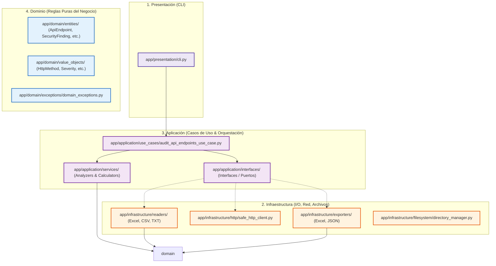

# 🛡️ Auditor de Endpoints API — Enterprise-Grade Defensive Security

[](https://python.org)
[](https://blog.cleancoder.com/uncle-bob/2012/08/13/the-clean-architecture.html)
[](https://owasp.org/www-project-api-security/)
[](https://github.com/astral-sh/ruff)

Una solución empresarial de **Auditoría de Seguridad Pasiva y Hardening Defensivo** para APIs REST. Diseñada bajo la rigurosa guía de **Clean Architecture**, principios **SOLID**, y alineada con la taxonomía internacional de riesgos de **OWASP API Security**.

```
    ___    ____  ____   ______                 __                  _     __            
   /   |  / __ \/  _/  / ____/___  ____  _____/ /_____  ____  ____  / /_   / /_  __  __   
  / /| | / /_/ // /   / __/  / __ \/ __ \/ __  / __/ __ \/ __ \/ __ \/ __/  / __ \/ / / /   
 / ___ |/ ____// /   / /___ / / / / /_/ / /_/ / /_/ /_/ / / / / / / / /_   / /_/ / /_/ /    
/_/  |_/_/   /___/  /_____//_/ /_/\____/\__,_/\__/\____/_/ /_/_/ /_/\__/  /_.___/\__, /     
                                                                                /____/      
                      [ MOTOR DEFENSIVO DE AUDITORÍA Y HARDENING ]
```

---

## ⚠️ Declaración de Uso Autorizado y Ético

> [!CAUTION]
> **ESTA HERRAMIENTA ES ESTRICTAMENTE DEFENSIVA Y NO INTRUSIVA.**
> El software ha sido desarrollado específicamente para labores de autoevaluación, auditoría autorizada de sistemas internos y hardening preventivo. Solo debe ejecutarse en infraestructuras sobre las cuales posea **autorización expresa por escrito** o que sean de su legítima propiedad. El uso no autorizado o malicioso infringe los marcos legales locales e internacionales y no cuenta con el respaldo ni la responsabilidad del autor.

---

## 📋 Filosofía y Alcance Técnico

A diferencia de las herramientas de escaneo tradicionales basadas en ataques destructivos, fuzzing masivo o payloads intrusivos que saturan y corrompen bases de datos en entornos de pre-producción/QA, el **Auditor de Endpoints API** utiliza un enfoque de **evaluación pasiva inteligente** y **auditoría dinámica no invasiva**:

* **Verbos No Modificadores por Defecto**: Las peticiones de escritura complejas (`POST`, `PUT`, `PATCH`, `DELETE`) son auditadas dinámicamente mediante el uso seguro de técnicas `OPTIONS` y `HEAD`, o mediante un modo controlado de verificación inocua (`SAFE_CHECK`) para prevenir mutaciones incidentales en el servidor.
* **Resiliencia Extrema a Nivel de Red**: El cliente HTTP integrado cuenta con aislamiento de fallas a nivel de DNS, SSL erróneos, timeouts configurables y retries controlados sin interrumpir la cola de escaneo global.
* **Enmascaramiento de Datos Críticos**: Todo hallazgo sensible o credencial recopilada como evidencia técnica es enmascarada inmediatamente antes de registrarse en memoria, garantizando la confidencialidad de la información y previniendo fugas accidentales en reportes.

---

## ✨ Módulos Principales de Auditoría y Detección

### 🔑 1. Exposición y Bypass de Autenticación
Determina el grado de robustez del control de acceso de la API. Evalúa si recursos clasificados explícitamente como **privados** o **protegidos** devuelven respuestas exitosas (estados `2xx`) cuando se omiten por completo los tokens de autorización (`Bearer`, `API Key`, `Session Cookie`).

### 📦 2. Fugas de Información Sensible e Identificadores (PII)
Analiza exhaustivamente las cabeceras y los cuerpos de respuesta (`body`) para descubrir si se están divulgando datos confidenciales que atentan contra regulaciones globales (como GDPR, PCI-DSS o leyes nacionales de protección de datos personales):
* **Credenciales**: `passwords`, `private_keys`, tokens JWT, tokens de acceso expuestos, contraseñas en claro.
* **Datos Personales**: Emails, teléfonos, números de identidad (DNI, Cédula), tarjetas de crédito estructuradas, códigos CVV.

### 🐛 3. Revelación de Errores Verbosos y Stack Traces
Examina si la aplicación revela información interna sobre su configuración, la estructura de la base de datos o el código fuente al recibir peticiones inusuales o códigos de error `5xx`:
* **Stack Traces**: Firmas específicas de excepciones de frameworks en Python, Node.js, PHP, Java, Express y Django.
* **Bases de Datos**: Fugas de sintaxis SQL, Postgres, MySQL, MongoDB, SQLite y dependencias internas de ORM (`Prisma`, `Sequelize`, `SQLAlchemy`, `Hibernate`).

### 🛡️ 4. Análisis de Cabeceras de Seguridad y Metadatos
Verifica la presencia y la configuración correcta de las cabeceras estándar de protección de red:
* **Cabeceras Mandatorias**: `Content-Type`, `Cache-Control`, `X-Content-Type-Options`, `X-Frame-Options` (Clickjacking), `Content-Security-Policy` (CSP), `Strict-Transport-Security` (HSTS), `Referrer-Policy`, y `Permissions-Policy`.
* **Exposición de Metadatos**: Identifica campos como `X-Powered-By`, `Server`, `X-AspNet-Version` o `X-Runtime` que exponen innecesariamente versiones exactas de tecnologías facilitando labores de reconocimiento técnico para atacantes.

### 🚦 5. Coherencia REST y Exposición de Métodos HTTP
Evalúa si la API responde con los códigos estandarizados correctos ante errores de autorización (401/403) o recursos inexistentes (404). Asimismo, escanea los verbos permitidos por el servidor, alertando si se encuentran expuestos métodos inseguros u obsoletos como `TRACE`.

---

## 🏗️ Arquitectura de Software (Clean Architecture)

El motor ha sido implementado bajo un diseño modular limpio y desacoplado, separando de forma hermética la lógica de negocio respecto a los frameworks externos y componentes de I/O. Las dependencias siempre fluyen **hacia adentro**, apuntando a abstracciones y no a concreciones.



---

## 🛠️ Instalación Profesional y Requisitos

### Requisitos Mínimos
* **Python 3.11** o superior instalado en el path del sistema.
* Entorno de consola con permisos de lectura/escritura en el workspace actual.

### Configuración del Entorno de Desarrollo (Windows, Linux y macOS)

1. **Clonación del Repositorio**:
   ```bash
   git clone https://github.com/usuario/api-endpoint-auditor.git
   cd api-endpoint-auditor
   ```

2. **Creación del Entorno Virtual Aislado (`venv`)**:
   ```bash
   python -m venv venv
   ```

3. **Activación del Entorno**:
   * **En Windows (PowerShell)**:
     ```powershell
     .\venv\Scripts\Activate.ps1
     ```
   * **En Windows (CMD)**:
     ```cmd
     .\venv\Scripts\activate.bat
     ```
   * **En Linux y macOS**:
     ```bash
     source venv/bin/activate
     ```

4. **Instalación de Dependencias**:
   ```bash
   pip install --upgrade pip
   pip install -r requirements.txt
   ```

---

## 🚀 Guía de Uso del Auditor

### 📁 1. Preparación del Archivo de Entrada (`datos_entrada/`)

En la primera ejecución del programa, la herramienta inicializará automáticamente el directorio `datos_entrada/` y sembrará una plantilla altamente ilustrativa denominada `endpoints.xlsx`.

Usted puede alimentar al auditor utilizando cualquiera de las siguientes tres interfaces de entrada según sus flujos operativos:

#### A. Plantilla Excel (`endpoints.xlsx`)
Complete la hoja de cálculo con las rutas técnicas a auditar:

| nombre | url | metodo | requiere_auth | tipo_endpoint | descripcion |
| :--- | :--- | :---: | :---: | :---: | :--- |
| **Listar Usuarios** | `https://api.empresa.com/v1/users` | `GET` | `si` | `privado` | Retorna el listado de usuarios del backend |
| **Login Público** | `https://api.empresa.com/v1/auth/login` | `POST` | `no` | `publico` | Endpoint público para inicio de sesión |
| **Crear Transacción** | `https://api.empresa.com/v1/billing` | `POST` | `si` | `privado` | Generación de facturación |

#### B. Archivo CSV (`endpoints.csv`)
El auditor soporta carga masiva en formato CSV (delimitado por coma o punto y coma), mapeando automáticamente las columnas.

#### C. Lista Plana TXT (`endpoints.txt`)
Para escaneos rápidos, provea una URL absoluta por línea. El motor asumirá por defecto el método `GET` con acceso clasificado como `desconocido`.

---

### 💻 2. Ejecución desde Consola

Para iniciar el flujo completo de escaneo seguro, normalización de datos, peticiones dinámicas de red y exportación automatizada de reportes, ejecute el siguiente comando:

```bash
python -m app.main
```

Durante la ejecución, verá un dashboard en tiempo real con estadísticas y bitácora estructurada:

```text
======================================================================
                 AUDITOR DE ENDPOINTS API - SEGURIDAD DEFENSIVA       
======================================================================
[*] Archivo de entrada: datos_entrada\endpoints.xlsx
[*] Modo seguro (SAFE_MODE): ACTIVO
[*] Timeout por request: 8.0 segundos
[*] Iniciando auditoría segura...
----------------------------------------------------------------------
[2026-05-25 18:00:00] [INFO] - Leyendo endpoints desde endpoints.xlsx...
[2026-05-25 18:00:00] [INFO] - Endpoints encontrados: 4
[2026-05-25 18:00:00] [INFO] - Validando endpoints...
[2026-05-25 18:00:00] [INFO] - Auditando endpoint [1/4]: GET https://api.github.com/users
[2026-05-25 18:00:01] [INFO] - Auditando endpoint [2/4]: POST https://httpbin.org/post
[2026-05-25 18:00:02] [INFO] - Auditando endpoint [3/4]: GET https://httpbin.org/status/500
...
[2026-05-25 18:00:05] [INFO] - Generando reporte Excel...
[2026-05-25 18:00:05] [INFO] - Reporte Excel generado correctamente
[2026-05-25 18:00:05] [INFO] - Generando reporte JSON...
[2026-05-25 18:00:05] [INFO] - Reporte JSON generado correctamente
[2026-05-25 18:00:05] [INFO] - Proceso finalizado
```

---

## 📊 Algoritmo de Scoring y Severidades (0 a 100)

Cada endpoint recibe un **Score de Riesgo** cuantitativo (tope máximo de 100), el cual es calculado dinámicamente según la severidad e impacto de cada hallazgo descubierto. Las ponderaciones por defecto en el sistema son:

| Tipo de Hallazgo | Penalización | Severidad | Descripción del Riesgo |
| :--- | :---: | :---: | :--- |
| **Auth Exposure** | `+35` | 🔴 Crítico | Endpoint marcado privado retorna `200 OK` sin credenciales. |
| **Sensitive Data** | `+30` | 🟠 Alto | Presencia de tokens en claro, PII, passwords o tarjetas en la respuesta. |
| **Verbose Errors** | `+25` | 🟠 Alto | Stack traces, excepciones o trazas SQL directas de la base de datos. |
| **Unsafe Verbs** | `+20` | 🟠 Alto | Servidor responde exitosamente al verbo de diagnóstico `TRACE`. |
| **Write Exposures** | `+15` | 🟡 Medio | Métodos de escritura expuestos (`PUT`, `DELETE`) en zonas no protegidas. |
| **Missing Security Headers** | `+10` | 🟢 Bajo | Ausencia de cabeceras de protección básicas (`X-Frame`, `CSP`, `HSTS`). |
| **Status Inconsistencies** | `+10` | 🟢 Bajo | Desviación de códigos de error REST (ej. responder 200 con contenido de error). |
| **Info Disclosure Headers** | `+5` | 🔵 Info | Divulgación de versiones de software a través de `Server` o `X-Powered-By`. |

### Rango de Riesgo del Endpoint
* **0 a 20**: 🟢 **Bajo (LOW RISK)** — Endpoint seguro con desviaciones mínimas de metadatos.
* **21 a 50**: 🟡 **Medio (MEDIUM RISK)** — Presencia de debilidades de configuración o ausencia de cabeceras.
* **51 a 75**: 🟠 **Alto (HIGH RISK)** — Fugas de datos importantes, errores internos o exposición de verbos peligrosos.
* **76 a 100**: 🔴 **Crítico (CRITICAL RISK)** — Bypass de autenticación confirmado. Exposición inminente.

---

## 📁 Reportes Ejecutivos Generados (`datos_salida/`)

La herramienta automatiza la generación de evidencias técnicas, incrementando automáticamente el número correlativo al final del nombre si ya existen archivos en la carpeta de destino (`report.xlsx`, `report_1.xlsx`, etc.) para proteger los escaneos previos contra sobreescrituras incidentales.

### Estructura Técnica del Reporte Excel (Multi-Sheet)

1. **`Resumen`**: Matriz ejecutiva consolidada (URL, método, código de estado HTTP recibido, tiempo de respuesta en milisegundos, score final y su correspondiente nivel de riesgo visualizado).
2. **`Hallazgos`**: Bitácora centralizada que asocia a cada endpoint el hallazgo técnico identificado, su categoría, severidad y la recomendación específica de hardening.
3. **`Métodos HTTP`**: Comparativa entre los métodos declarados originalmente y los métodos reales detectados dinámicamente mediante el análisis de cabeceras seguras.
4. **`Datos Sensibles`**: Muestra las fugas de información personal identificable (PII) recopiladas y las **versiones enmascaradas** de forma segura utilizadas como evidencia técnica.
5. **`Errores Detallados`**: Tabla de trazas de desarrollo, stack traces, rutas físicas o metadatos de DB filtrados en las respuestas.
6. **`Recomendaciones`**: Matriz priorizada por severidad que sirve de plan de trabajo técnico (Hardening Checklists) para el equipo de desarrollo.
7. **`Errores`**: Detalle de incidencias de red, caídas de host, problemas con certificados SSL locales o timeouts para agilizar diagnósticos de conectividad.

---

## 🧪 Pruebas Unitarias e Integradas Automatizadas

El proyecto incluye una robusta suite de pruebas con **100% de éxito** para asegurar que cualquier modificación de código mantenga la estabilidad funcional del motor.

```bash
# Ejecutar todas las pruebas unitarias y de integración
pytest -v
```

---

## 🧹 Estándares de Calidad de Código (Linter & Format)

Para mantener la excelencia en la mantenibilidad del código bajo los estándares de la industria, el proyecto utiliza **Ruff** para asegurar el cumplimiento estricto de **PEP 8**:

```bash
# Validar buenas prácticas y reglas estáticas de código
ruff check .

# Corregir formato y ordenar imports automáticamente
ruff format .
```

---

## 🔮 Roadmap de Innovación

El diseño desacoplado de Clean Architecture permite proyectar el crecimiento de la plataforma con los siguientes módulos planificados:
- [ ] **Integración CI/CD**: Actions de GitHub, pipelines de GitLab para bloquear despliegues en caso de descubrir riesgos críticos.
- [ ] **Importación OpenAPI / Swagger**: Soporte directo para consumir archivos de definición de API y automatizar la generación de la lista de endpoints.
- [ ] **Dashboard Web Integrado**: Interfaz en tiempo real en React y Tailwind CSS para visualización ejecutiva en alta definición.
- [ ] **Auditoría Criptográfica de JWT**: Evaluación en vivo de la calidad de firmado de tokens (algoritmos débiles, clave vacía, o key-confusion).
